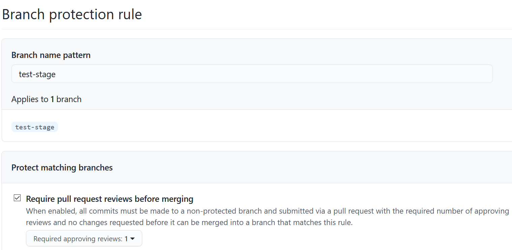
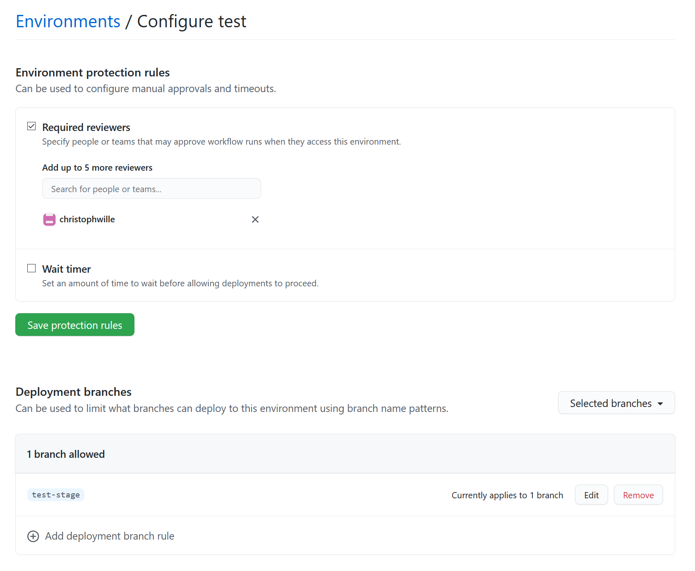

# Deploying to Stages

Recommended reading: [Deployment with GitHub Actions: The Bad and the Ugly](https://colinsalmcorner.com/deployment-with-github-actions/)

I am using branch protection ([docs](https://docs.github.com/en/github/administering-a-repository/about-protected-branches)) and environments ([docs](https://docs.github.com/en/actions/reference/environments)) in this playground.

Please read [Service Principal credentials in Key Vault](secrets-in-keyvault.md) in this repo! Note that I am not using enviroment
secrets but a single service principal for all stages - but the service principal is restricted to specific resource
groups, as this limits the potential for damage. Especially as the approach is not intended for public repos.

Another option would be to use publish profiles: but in my scenario that would mean one for the Function, one for the App Service and that times the stages... plus the hassle of actually getting the publish profiles during provisioning and adding them as environment secrets. (not sure if that is any better, but definitely better for public repos)

## Branch Protection

Yes, I have admin override in this repository.

## Environment

The environment is locked to a single branch, and that is `test-stage`. That way even a manual run of an action is stopped dead in its tracks when it is not happening on the correct branch.

