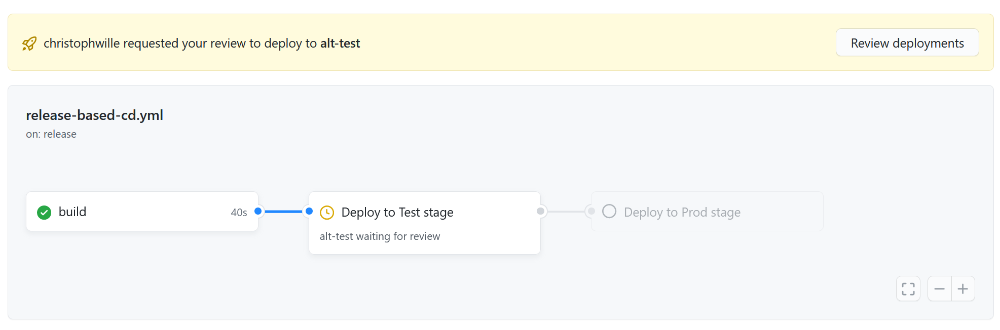
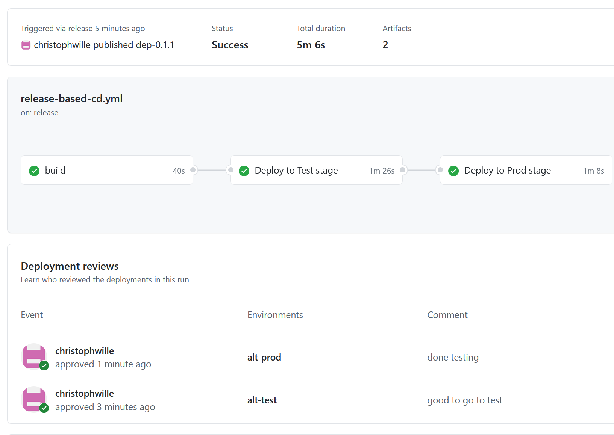

# Deploy on Release

This is a variation of deploying on push to a protected branch - simpler I would argue.

It contains three jobs: build, deploy to test and deploy to prod. Each job depends on the previous job, and the action starts running when a new release is published. Build runs immediately and the waits:

All stages (except dev, which auto-deploys on push to main) are kept in one workflow definition using the same artifacts all the way to production. Propagation happens when the reviewer for the next environment ok's the workflow (until it hits production).

